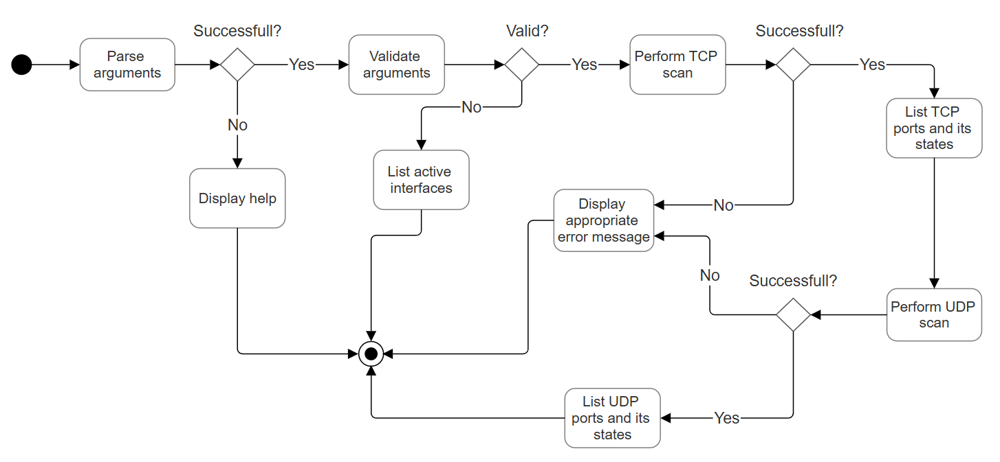

# L4 Scanner
## Overview
A network scanner for TCP and UDP port scanning supporting IPv4/IPv6, written in C++.

## Table of Contents
- [Summary](#summary)
- [Theory](#theory)
  - [TCP SYN Scanning](#tcp-syn-scanning)
  - [UDP Scanning](#udp-scanning)
  - [Raw Socket Programming](#raw-socket-programming)
- [How to Use](#how-to-use)
- [Code Structure](#code-structure)
  - [Key Classes and Namespaces](#key-classes-and-namespaces)
- [Flow Diagram](#flow-diagram)
- [Testing](#testing)
  - [Automated Tests](#automated-tests)
    - [Unit Tests](#unit-tests)
    - [Final Tests](#final-tests)
  - [Manual Testing](#manual-testing)
    - [Testing in CLI](#testing-in-cli)
    - [Testing using Wireshark](#testing-using-wireshark)

## Summary
This application scans target hosts for open, closed, or filtered TCP/UDP ports. Key features:
- **TCP SYN Scan**: Detects open/closed/filtered ports via raw socket packets.
- **UDP Scan**: Identifies closed ports using ICMP.
- **Dual-Stack Support**: Handles both IPv4 and IPv6 addresses.
- **Flexible Input**: Accepts port ranges (e.g., `20-23`), interface names, or domain names.

## Theory
### TCP SYN Scanning
- **Mechanism**:
  - Crafts a SYN segment with:
    - Random sequence number for security ([RFC 6528](https://tools.ietf.org/html/rfc6528)).
    - Custom IP headers using the `IP_HDRINCL` socket option.
- **Response Interpretation**:
  | Response  | State    | RFC Reference                          |
  |-----------|----------|----------------------------------------|
  | SYN-ACK   | Open     | [RFC 793 Sec. 3.4](https://tools.ietf.org/html/rfc793#section-3.4) |
  | RST       | Closed   | [RFC 793 Sec. 3.4](https://tools.ietf.org/html/rfc793#section-3.4) |
  | Timeout   | Filtered | [RFC 1122 Sec. 4.2.3.9](https://tools.ietf.org/html/rfc1122#section-4.2.3.9) |

### UDP Scanning
- **ICMP Error Handling**:
  - **IPv4**: ICMP "Destination Unreachable" (Type 3, Code 3 - Port Unreachable).
  - **IPv6**: ICMPv6 "Destination Unreachable" (Type 1, Code 4 - Port Unreachable).
- **False Positives**:
  - Open ports may appear filtered due to:
    - Firewall rate limiting ([RFC 4890](https://tools.ietf.org/html/rfc4890)).
    - Network congestion ([RFC 8085](https://tools.ietf.org/html/rfc8085)).

### Raw Socket Programming
- **Kernel Bypass**:
  - Direct header manipulation using `sendto()` with custom:
    - IP headers (including TTL and HLEN fields).
    - TCP/UDP checksums (calculated using pseudo-headers per [RFC 1071](https://tools.ietf.org/html/rfc1071)).
- **Privilege Requirements**:
  - Requires `CAP_NET_RAW` (Linux) or Administrator privileges (Windows) due to security constraints ([RFC 3493](https://tools.ietf.org/html/rfc3493)).

## How to Use
```
./ipk-l4-scan {-h} [-i interface | --interface interface] [--pu port-ranges | --pt port-ranges | -u port-ranges | -t port-ranges] {-w timeout} [hostname | ip-address]
```

## Code Structure
### Key Classes and Namespaces
1. **`ArgParser`**:  
   - Parses CLI arguments (interface, ports, target).
   - Parses port ranges (e.g. `1,2-10,15`).
   - Validates inputs (lists active interfaces if the input is incomplete).

2. **`TCPScanner`**:  
   - Crafts raw TCP SYN packets.
   - Listens for SYN-ACK/RST responses.
   - Handles IPv4/IPv6 headers and checksums.
   - Lists ports and their states

3. **`UDPScanner`**:  
   - Sends UDP packets and listens for ICMP errors.
   - Calculates UDP checksums with pseudo-headers.
   - Lists ports and their states.

4. **`Utils`**:  
   - IP validation/conversion (`stringToIPv4`, `isIPv6`).
   - Checksum calculation for headers.

## Flow Diagram


## Testing
### Automated Tests
#### Unit Tests

#### Final Tests

### Manual Testing
#### Testing in CLI
- **Example Command**:  
  ```
  ./ipk-l4-scan -i eth0 --pt 21,22,143 --pu 53,67 localhost
  ```
- **Expected Output**:  
  ```
  127.0.0.1 21 tcp closed
  127.0.0.1 22 tcp open
  127.0.0.1 143 tcp filtered
  127.0.0.1 53 udp closed
  127.0.0.1 67 udp open
  ```
#### Testing using Wireshark

## Bibliography
- Braden, R. *Requirements for Internet Hosts* [online]. RFC 1122. Internet Engineering Task Force (IETF), October 1989. Available at: https://tools.ietf.org/html/rfc1122. [cit. 2025-03-26].

- Conta, A. and Deering, S. *Internet Control Message Protocol (ICMPv6) for the Internet Protocol Version 6 (IPv6) Specification* [online]. RFC 4443. Internet Engineering Task Force (IETF), March 2006. Available at: https://tools.ietf.org/html/rfc4443. [cit. 2025-03-26].

- Deering, S. and Hinden, R. *Internet Protocol, Version 6 (IPv6) Specification* [online]. RFC 8200. Internet Engineering Task Force (IETF), July 2017. Available at: https://tools.ietf.org/html/rfc8200. [cit. 2025-03-26].

- Postel, J. *Transmission Control Protocol* [online]. RFC 793. Internet Engineering Task Force (IETF), September 1981. Available at: https://tools.ietf.org/html/rfc793. [cit. 2025-03-26].